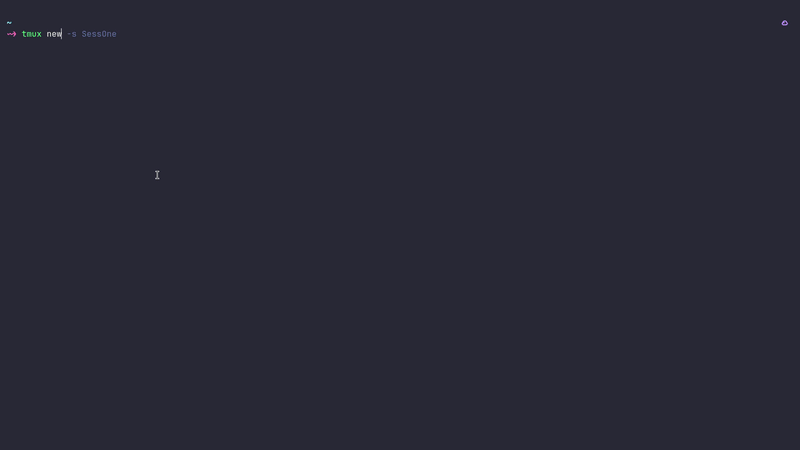

<p align="center" >
    
</p>


## 🚀 Installation
### Pre-requisite:
#### javascript runtime environment - nodeJs (latest LTS preferred)
* follow steps from official documentation of nodejs here:  
[nodeJs Official Docs](https://nodejs.org/en/download)   

Run the following commands to clone and install the dotfiles:

*On fedora:*
```
sudo dnf install -y git  
```
*On Ubuntu:*
```
sudo apt-get install -y git
```

```
git clone https://github.com/suyash-sketch/mydotfiles.git ~/dotfiles  
```

```
cd ~/dotfiles  
```

```
chmod +x install.sh  
```

```
./install.sh  
```

### To install tmux plugins manager

```
git clone https://github.com/tmux-plugins/tpm ~/.config/tmux/plugins/tpm
```
Reload your tmux config
```
tmux source-file ~/.config/tmux/tmux.conf
```

Install plugins inside tmux
```
 ` followed by shift + i or (ctrl +b) followed by shift + i
```

## 🪟 Windows & WSL Users: Setting Up Nerd Fonts

If you are using WSL, this installation script will skip installing local Linux fonts. Because your terminal is drawn by Windows, you must install the Nerd Font directly on your Windows host machine for icons (like Starship and Fastfetch) to render correctly in Windows Terminal, PowerShell, or Command Prompt.

Step 1: Download a Nerd Font  
1. Go to the [Nerd Fonts Releases page](https://www.nerdfonts.com/font-downloads)  

2. Download your preferred font (e.g., JetBrainsMono.zip).  

Step 2: Install the Font on Windows  
1. Extract the downloaded .zip folder.  

2. Select all the .ttf files inside, right-click, and select Install (or Install for all users).

Step 3: Configure Your Windows Applications  
Now you need to tell your Windows apps to use this font:  
* Windows Terminal:  
Open Settings (Ctrl + ,) --> Click on Defaults (under Profiles) --> Appearance --> Change the Font face to your new Nerd Font (e.g., JetBrainsMono NFP).  

* VS Code (Remote WSL):  
Open Settings (Ctrl + ,) --> Search for terminal font --> Set Terminal > Integrated: Font Family to 'JetBrainsMono Nerd Font'.  

* Legacy PowerShell / Command Prompt:  
Right-click the title bar --> Properties --> Font tab --> Select your Nerd Font from the list. *(Note: Windows Terminal is highly recommended over legacy consoles).*
